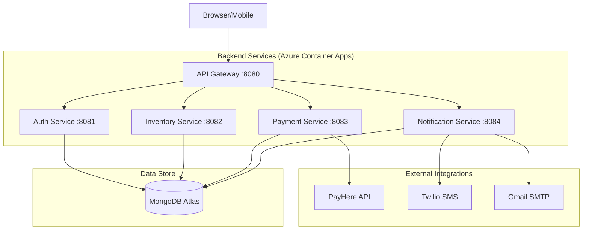

# Green-Cart: Microservices E-Commerce Platform

[](https://sonarcloud.io/summary/new_code?id=Green-Cart-Marketplace_Green-Cart)
[](https://github.com/Green-Cart-Marketplace/Green-Cart/actions)

Green-Cart is a production-grade, microservice-based e-commerce platform developed as a prototype for the **Current Trends in Software Engineering (CTSE)** assignment at **SLIIT**. It showcases modern architectural patterns, including independent service deployability, containerization, and automated DevSecOps pipelines.

## 🏗️ Architecture Overview

The system follows a microservices architecture with a centralized API Gateway that routes traffic to specialized backend services. All services are containerized and deployed on **Azure Container Apps**.

## 🌐 Production URLs
- **Storefront (Frontend):** `https://greencartmarket.labs.furo.lk`
- **API Gateway:** `https://greencartmarket.labs.furo.lk/api`



## 📦 Services Breakdown

| Service | Description | Port | Tech Stack |
|:---|:---|:---|:---|
| **API Gateway** | Entry point for all external requests. Handles proxying and global middleware. | 8080 | Node.js, Express |
| **Authentication** | User management, JWT-based login/registration, and token validation. | 8081 | Node.js, Mongoose, JWT |
| **Inventory** | Product CRUD, stock management, shopping cart, and order processing. | 8082 | Node.js, Mongoose |
| **Payment** | Payment initiation, PayHere integration, and transaction status tracking. | 8083 | Node.js, PayHere SDK |
| **Notification** | Multi-channel notifications (In-app, SMS via Twilio, Email via SMTP). | 8084 | Node.js, Nodemailer, Twilio |
| **Frontend** | Responsive storefront UI for customer shopping experiences. | 3000 | Next.js, TypeScript |

## 🔐 Security and Communication

### External Security
- **JWT Authentication:** All protected routes require a valid JSON Web Token issued by the Authentication service.
- **CORS:** Restrictive CORS policies are enforced to allow only authorized origins (e.g., the production frontend).

### Internal Communication
To ensure that internal administrative actions (like triggering notifications from the payment service) are secure, the platform uses an **Internal API Key** mechanism.
- Services must include an `x-internal-api-key` header for inter-service HTTP calls.
- This key is shared across the environment and prevents unauthorized external access to internal endpoints.

## 🚀 Getting Started

### Prerequisites
- [Node.js 20+](https://nodejs.org/)
- [Docker & Docker Compose](https://www.docker.com/)
- [Azure CLI](https://learn.microsoft.com/en-us/cli/azure/install-azure-cli) (for deployment)

### Local Development (Docker Compose)
The easiest way to run the entire stack locally:

```bash
# Clone the repository
git clone https://github.com/Green-Cart-Marketplace/Green-Cart.git
cd Green-Cart

# Start all services
docker compose up --build
```

Access the storefront at `http://localhost:3000`.

### Manual Service Start
If you prefer running a single service:
```bash
cd <service_directory>
npm install
npm run dev
```

## ☁️ Deployment

### Infrastructure (Azure)
The backend is deployed to **Azure Container Apps** within the `greencart-env` environment.
- **Resource Group:** `greencart-rg`
- **Networking:** Internal FQDN resolution for service-to-service calls (e.g., `http://greencart-notification`).
- **Custom Domain:** The frontend and API gateway are accessible via `greencartmarket.labs.furo.lk` with properly configured CORS policies.

### CI/CD Pipelines
Automated deployment is handled via **GitHub Actions**:
- `sonarcloud-ci.yml`: Performs SAST scanning and quality gate checks.
- `<service>-cd.yml`: Builds Docker images and deploys them to Azure upon merges to `main`.

### Post-Deployment Fixes
If notifications are not triggering in the deployed environment, ensure the `INTERNAL_API_KEY` and `NOTIFICATION_SERVICE_URL` are correctly set in the Azure portal or run the provided fix script:
```bash
bash scripts/fix-azure-notification-env.sh
```

## 📂 Repository Structure
```text
Green-Cart/
├── .github/workflows/    # CI/CD pipeline definitions
├── api-gateway/          # Custom Node.js API Gateway
├── authentication/       # Identity & Access Management service
├── frontend/             # Next.js Storefront application
├── inventory/            # Catalog, Cart, and Order service
├── notification/         # Event-driven notification service
├── payment/              # Transaction & Payment processing service
├── scripts/              # Deployment and utility scripts
├── shared/               # Architecture diagrams and shared API specs
└── docker-compose.yml    # Local multi-container orchestration
```

## 📄 License
This project is licensed under the MIT License - see the [LICENSE](LICENSE) file for details.
